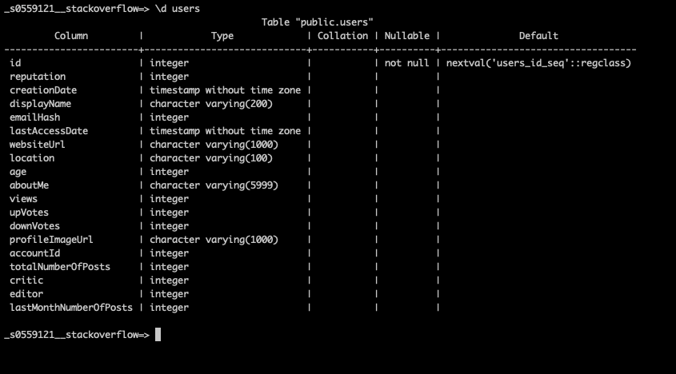
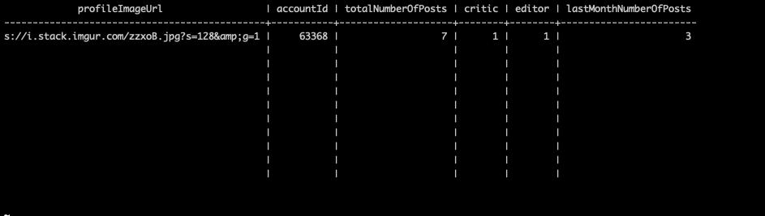
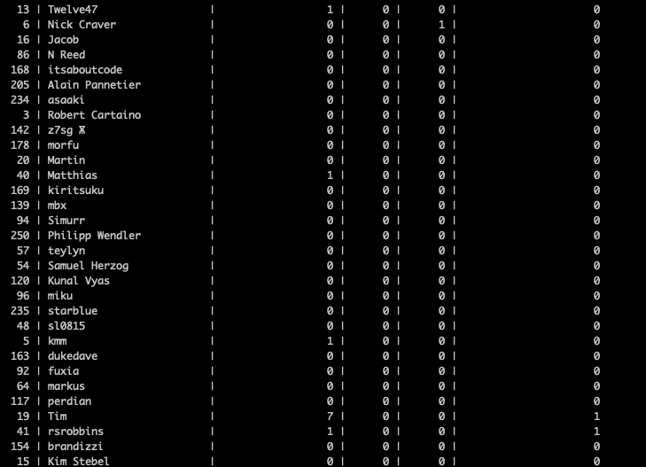

# README
This is my pyspark pipeline for processing stackoverflow xml data available at https://archive.org/download/stackexchange  
This pipeline comes with a __handy playground jupiter notebooks__ for understanding and exploring __as well as classic python scripts__ that you can use anywhere

# Environment and dependencies
The dependencies for virtual environment are available in file stackoverflow-processing.yml  
Create environment with these dependencies if necessary (dependencies like pyspark, py4j etc.).  

__Command line__: 
 conda env create -f stackoverflow-processing.yml  
source activate TestSpark for Mac (or 'activate TestSpark' for Linux)  

__PyCharm__:
  create environment with command line (see above)  
Go to Preferences -> Project Interpreter -> Choose TestSpark  
 
PS: In order to use spark JDK should be installed on your machine as well.  

# Published Users Table
__Available here:__  
command line:  
__1)__ Please inquire to get access
  __2)__ Please inquire to get access
  __3)__ check schema: \d users

  __4)__ run queries (__please use double quotes if quering columns with camelCase__):
   __Example 1__: SELECT * FROM USERS WHERE id=8; (__as you can see the required additional columns are present__);

  __Example 2__: SELECT id, "displayName", "totalNumberOfPosts", critic, editor, "lastMonthNumberOfPosts" from USERS;

  __PS:__ Note, that I did not convert all data (200 mb), because I don't have access to free clusters. I took the shorter version of these files (I just reduced original big xml to smaller ones). Pipeline works the same way regardless of the amount of data
  __PS2:__ You can also read from database in python scripts or jupyter notebooks (look below)
  __PS3:__ I set all columns except primary key to be nullables because data may be inconsistent.
  __PS4:__ Since the spark does not work very well with autoincrement, there is additionaly sequence attached to the table that increments it for us (set_db.sql file, available in main/create_database folder).

# Note to Mac OS users
Currently spark have some issues when executing locally without internet connection on Mac OS. It is advised to be connected to the internet. Otherwise see this solution https://stackoverflow.com/a/41914718/7331010

# Use with python scripts in your workflow
Python scripts are available in main/pipeline folder.
  __1) run_pipeline.py__ is responsible for executing the pipeline. Change the data_directory to point to any stackoverflow data. Change jdbc properties if you want to store the data on your own sql server. __This is the only python script you need to execute.__
  __2) xml_converter.py__ converts xml data to spark dataframes. There is also a handy function to store it in spark parquet format
  __3) data_manipulator.py__ adds additional columns to users dataframe: Total number of posts created, Number of posts in the last 30 days, and columns with 1/0 flags for badges “Critic” and “Editor” 
  __4) sql_handler.py__ writes/reads dataframe to/from postgresql.
  In order to store data on your own sql server or local sql database, use __set_db.sql__ file, available in main/create_database folder, to create database, and then change jdbc properties run_pipeline.py file

# Explore, analyze and run with Jupyter Notebooks
I created several Jupyter notebooks in the __'playground' folder (there are independent from python scripts and made solely as playground and analyzing tool)__:
  __1) data-convert.ipynb__. This notebook provides the way to parse xml data and store it in spark parquet format. 
Since there are issues with parsing xml in spark (see https://github.com/databricks/spark-xml/issues/109) the xml is parsed as text as casted as certain type (integer, timestamp etc.)
The result is then saved as spark parquet format. The latter is done for exploring purposes so user don't parsed xml every time. __Before running this notebook please clear "outputdata" folder__.
  In the pipeline python scripts data stored on sql server so there is no need to store it locally in parquet format.
  __2) data_publish_users.ipynb__ adds several columns to the users dataframe: Total number of posts created, Number of posts in the last 30 days, and columns with 1/0 flags for badges “Critic” and “Editor”.   
Then it stored this new dataframe as users table on local and remote sql server (postgre). The functionality for reading is also provided
  __3) data-analyze.ipynb__ retrieves the data from parquet files and stores it in memory. Play with data as you please.
  __Other__:
  In order to store data on your own sql server or local sql database, use set_db.sql file, available in main/create_database folder, to create database, and then change jdbc properties in notebook to your database
__PS:__ if you want just to store data in parquet format, clear the main/output folder first

# How to test
PyCharm: run test_pipeline.py file  
Command line: go to main/pipeline folder and run: python3 -m unittest discover

